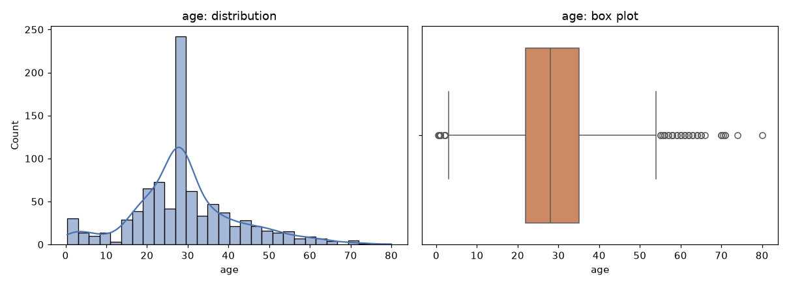
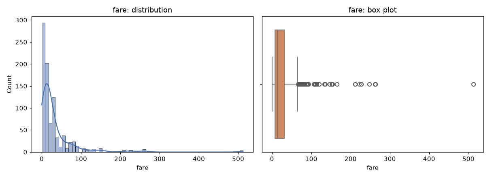
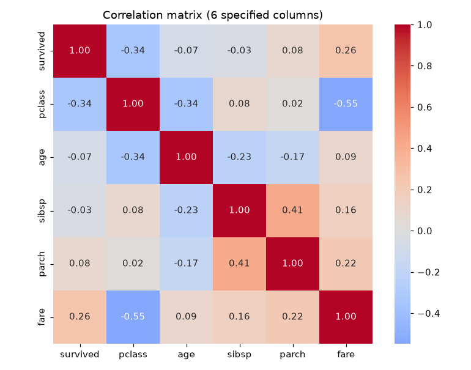
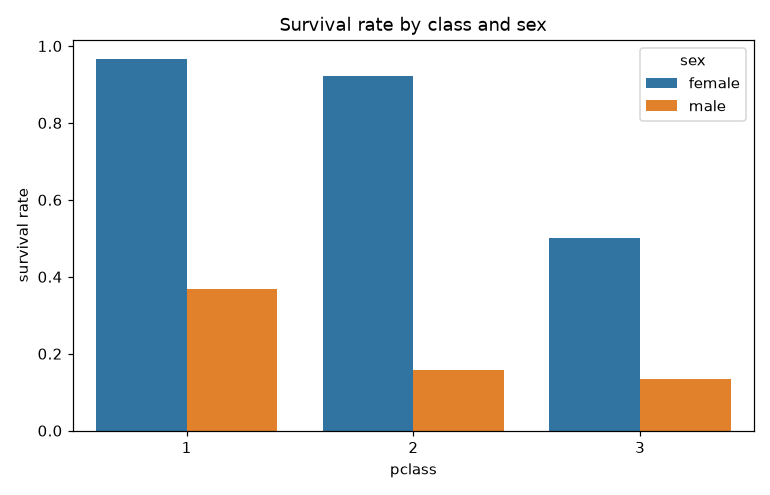
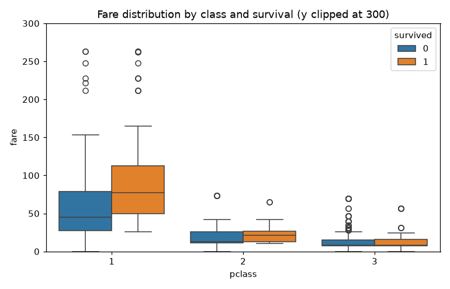
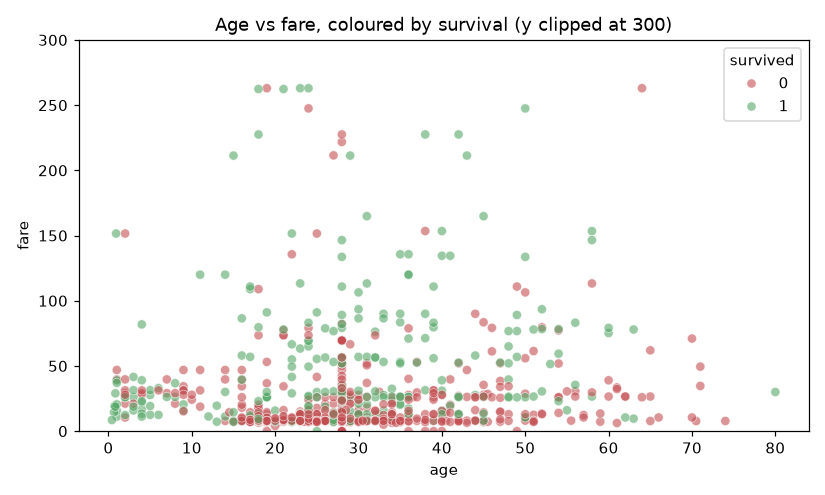
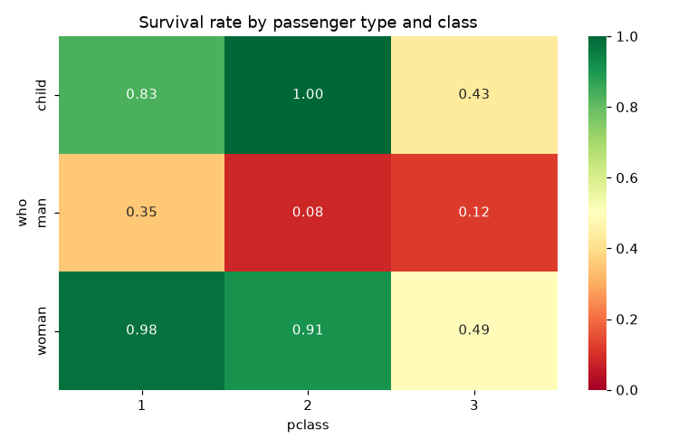
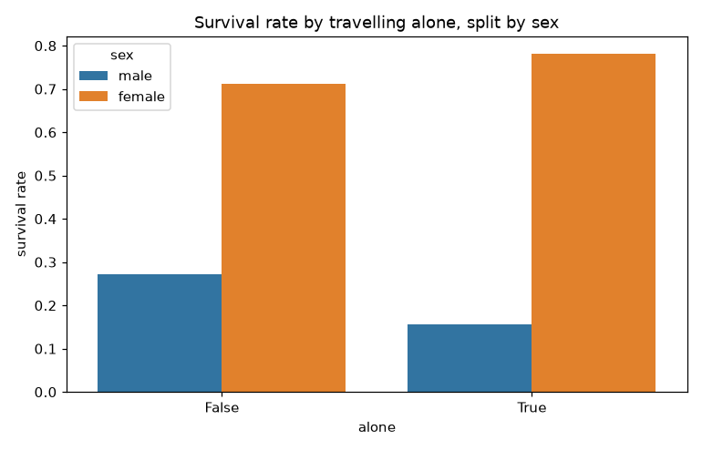
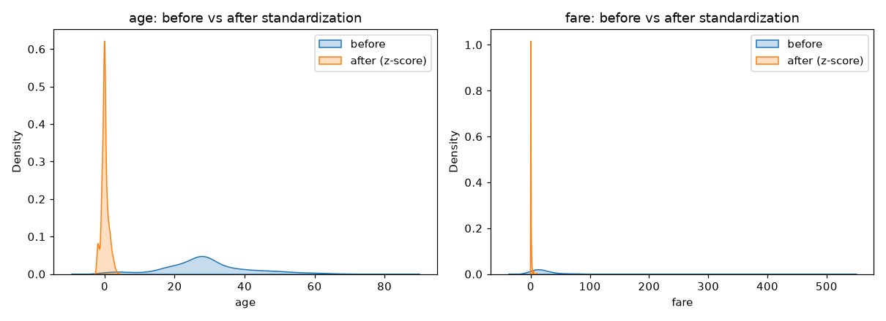

# Module 2 Part A - EDA and data story

## Task 1 - Loading and profiling

Loaded via `sns.load_dataset('titanic')` and immediately snapshotted to `titanic.csv` (891 rows). This is the only raw load in the module; `02_modeling.py` reads that committed CSV.

`df.shape` -> **(891, 15)**

**df.info()**

```
<class 'pandas.DataFrame'>
RangeIndex: 891 entries, 0 to 890
Data columns (total 15 columns):
 #   Column       Non-Null Count  Dtype   
---  ------       --------------  -----   
 0   survived     891 non-null    int64   
 1   pclass       891 non-null    int64   
 2   sex          891 non-null    str     
 3   age          714 non-null    float64 
 4   sibsp        891 non-null    int64   
 5   parch        891 non-null    int64   
 6   fare         891 non-null    float64 
 7   embarked     889 non-null    str     
 8   class        891 non-null    category
 9   who          891 non-null    str     
 10  adult_male   891 non-null    bool    
 11  deck         203 non-null    category
 12  embark_town  889 non-null    str     
 13  alive        891 non-null    str     
 14  alone        891 non-null    bool    
dtypes: bool(2), category(2), float64(2), int64(4), str(5)
memory usage: 80.7 KB

```

**df.describe()**

```
         survived      pclass         age       sibsp       parch        fare
count  891.000000  891.000000  714.000000  891.000000  891.000000  891.000000
mean     0.383838    2.308642   29.699118    0.523008    0.381594   32.204208
std      0.486592    0.836071   14.526497    1.102743    0.806057   49.693429
min      0.000000    1.000000    0.420000    0.000000    0.000000    0.000000
25%      0.000000    2.000000   20.125000    0.000000    0.000000    7.910400
50%      0.000000    3.000000   28.000000    0.000000    0.000000   14.454200
75%      1.000000    3.000000   38.000000    1.000000    0.000000   31.000000
max      1.000000    3.000000   80.000000    8.000000    6.000000  512.329200
```

**Missing values, as a percentage of all 891 rows:**

|             |   missing_% |
|:------------|------------:|
| deck        |       77.22 |
| age         |       19.87 |
| embarked    |        0.22 |
| embark_town |        0.22 |


## Task 2 - Missing-value handling

Threshold rule from the brief: **under 5% missing -> drop those rows; 5%-30% -> impute**; above that, decide explicitly and justify.

| Column | Measured missing | Band | Strategy applied |
|---|---|---|---|
| `deck` | **77.22%** | above 30% | **Drop the column** |
| `age` | **19.87%** | 5-30% | **Impute** with the median |
| `embarked` | **0.22%** | under 5% | **Drop those rows** |
| `embark_town` | **0.22%** | under 5% | Same 2 rows as `embarked` |

**`deck` (77.22%) - dropped rather than encoded.** At 77.22% missing only ~203 of 891 passengers have a recorded deck, and that recording is not random: deck was transcribed mainly from surviving first-class cabin records. Encoding `'Missing'` as its own category would therefore create a level that is largely a proxy for *not first class*, duplicating information `pclass` already carries cleanly and completely. Imputing a value for 77% of rows would be fabrication, so the column is dropped.

**`age` (19.87%) - median-imputed.** This sits squarely in the 5-30% impute band. The median is used rather than the mean because age is right-skewed, so the median is the more robust centre.

**`embarked` / `embark_town` (0.22%) - rows dropped.** Two rows, comfortably under the 5% threshold. Dropping them costs 0.22% of the data.

Cleaned shape: **(889, 14)** (from (891, 15)). Remaining missing values: **0**


## Task 3 - Univariate analysis





**IQR outlier counts** (outside `[Q1 - 1.5*IQR, Q3 + 1.5*IQR]`):

| column   |   lower fence |   upper fence |   outliers |   % of rows |
|:---------|--------------:|--------------:|-----------:|------------:|
| age      |          2.5  |         54.5  |         65 |        7.31 |
| fare     |        -26.76 |         65.66 |        114 |       12.82 |


**`fare` central tendency:** mean = **32.10**, median = **14.45**, mode = **8.05**.

Mode (8.05) < median (14.45) < mean (32.10). That ordering - mean pulled furthest to the right, above the median, which in turn sits above the mode - is the textbook signature of a **right-skewed (positively skewed) distribution**. The long right tail comes from a small number of very expensive first-class fares dragging the mean upward while the bulk of passengers cluster near the mode; the 114 IQR outliers in `fare` are that same tail.


## Task 4 - Bivariate analysis

Survival rates computed with boolean masking (`&` / `|` combinations).

**(a) By sex**

| sex    |   survival rate |   n |
|:-------|----------------:|----:|
| female |          0.7404 | 312 |
| male   |          0.1889 | 577 |


**(b) By passenger class**

|   pclass |   survival rate |   n |
|---------:|----------------:|----:|
|        1 |          0.6262 | 214 |
|        2 |          0.4728 | 184 |
|        3 |          0.2424 | 491 |


**(c) By sex AND class** (combined masks)

| sex    |   pclass |   survival rate |   n |
|:-------|---------:|----------------:|----:|
| female |        1 |          0.9674 |  92 |
| male   |        1 |          0.3689 | 122 |
| female |        2 |          0.9211 |  76 |
| male   |        2 |          0.1574 | 108 |
| female |        3 |          0.5    | 144 |
| male   |        3 |          0.1354 | 347 |


**Correlation matrix** on exactly the six specified columns (`adult_male` and `alone` are excluded: they are derived flags computable from `sex`/`age` and from `sibsp`+`parch`, not independent measurements).

|          |   survived |   pclass |    age |   sibsp |   parch |   fare |
|:---------|-----------:|---------:|-------:|--------:|--------:|-------:|
| survived |      1     |   -0.336 | -0.07  |  -0.034 |   0.083 |  0.255 |
| pclass   |     -0.336 |    1     | -0.337 |   0.082 |   0.017 | -0.548 |
| age      |     -0.07  |   -0.337 |  1     |  -0.233 |  -0.171 |  0.094 |
| sibsp    |     -0.034 |    0.082 | -0.233 |   1     |   0.415 |  0.161 |
| parch    |      0.083 |    0.017 | -0.171 |   0.415 |   1     |  0.218 |
| fare     |      0.255 |   -0.548 |  0.094 |   0.161 |   0.218 |  1     |



**All off-diagonal pairs ranked by |correlation|:**

| pair              |   correlation |    abs |
|:------------------|--------------:|-------:|
| pclass - fare     |       -0.5482 | 0.5482 |
| sibsp - parch     |        0.4145 | 0.4145 |
| pclass - age      |       -0.3365 | 0.3365 |
| survived - pclass |       -0.3355 | 0.3355 |
| survived - fare   |        0.2553 | 0.2553 |
| age - sibsp       |       -0.2325 | 0.2325 |
| parch - fare      |        0.2175 | 0.2175 |
| age - parch       |       -0.1715 | 0.1715 |
| sibsp - fare      |        0.1609 | 0.1609 |
| age - fare        |        0.0937 | 0.0937 |
| survived - parch  |        0.0832 | 0.0832 |
| pclass - sibsp    |        0.0817 | 0.0817 |
| survived - age    |       -0.0698 | 0.0698 |
| survived - sibsp  |       -0.034  | 0.034  |
| pclass - parch    |        0.0168 | 0.0168 |


**Strongest pair: `pclass` and `fare` (-0.548).** Fare and class are two measurements of the same underlying thing - what a passenger paid and the tier that bought them. The sign is negative only because `pclass` is coded with 1 as the *best* class, so a lower class number goes with a higher fare. It is the strongest relationship in the matrix precisely because it is close to tautological rather than a discovered insight.

**Second strongest: `sibsp` and `parch` (0.415).** Both columns count family members aboard - siblings/spouses and parents/children respectively - so they rise and fall together: a passenger travelling as part of a family group tends to have non-zero values in both. Like the first pair this is structural rather than a discovered insight, and it is a warning for the modeling stage: the two features are partly redundant, which is exactly why the derived `alone` flag (computable from `sibsp + parch == 0`) was excluded from this matrix.

Worth noting what is **not** in the top two. The strongest correlation involving the target is `survived`-`pclass` at -0.336, only fourth overall, followed by `survived`-`fare` at 0.255. Every correlation with `survived` is modest, and that is expected rather than discouraging: the dominant survival driver is `sex`, a categorical column that cannot appear in a numeric correlation matrix at all. Task 4(a) above shows that effect plainly, and it is invisible here.


## Task 5 - Multivariate data story: who survived, and why



**Chart 1 - Survival rate by class and sex.** This is the central fact of the dataset: within every single class, women survived at far higher rates than men. First-class women survived at roughly 97%, while third-class men survived at under 14%. Class modulates the effect but never reverses it - even third-class women outperformed first-class men. Any model that fails to use `sex` is discarding the strongest available signal.



**Chart 2 - Fare by class and survival.** Within first class, survivors paid noticeably more than non-survivors, and the same gap is faintly visible in second and third class. This suggests fare carries information *beyond* the class label alone - plausibly cabin location on the upper decks, closer to the boat deck. The y-axis is clipped at 300 because a handful of extreme fares (the IQR outliers found in Task 3) otherwise flatten the whole plot.



**Chart 3 - Age against fare.** Survivors (green) dominate the upper band of the chart at essentially every age, confirming that fare separates outcomes more sharply than age does. Along the bottom - the cheap-ticket band where most passengers sit - the two colours are thoroughly mixed, which is why `fare` alone will not be a reliable predictor. The visible cluster of survivors among very young children at low fares is the 'children first' effect surviving even in third class.



**Chart 4 - Survival rate by passenger type and class.** Splitting into child / woman / man makes the 'women and children first' protocol explicit: children and women in first and second class survived at near-ceiling rates, while men are the dark band across all three classes. The sharpest drop in the entire grid is third-class children, who fared dramatically worse than children in the upper classes - the protocol was applied, but access to the boat deck was not equal.



**Chart 5 - Travelling alone.** Passengers travelling with family survived at higher rates than those travelling alone, but the effect is strongly sex-dependent: it is large for women and nearly flat for men. This is most likely confounding rather than causation - women travelling with family were disproportionately in the upper classes, and family groups were prioritised for lifeboats. It justifies keeping `sibsp` and `parch` as model features while treating `alone` itself as redundant with them.

**The story in one paragraph.** Survival on the Titanic was determined first by sex, second by class, and third by age - in that order. Being female roughly quadrupled a passenger's chance of survival; being in first rather than third class roughly doubled it again; being a child helped, but only if you were not in third class. Fare adds a little information beyond class, and family structure adds a little beyond that, but both are largely downstream of the same socio-economic divide. A good classifier should therefore lean heavily on `sex` and `pclass`, with `age` and `fare` as refinements.


## Task 6 - Exploratory standardization check

`z = (x - mean) / std` applied to `age` and `fare` on the **full cleaned DataFrame**. This is an EDA sanity check only - it deliberately does **not** feed into the modeling pipeline, which fits its own `StandardScaler` on the training split alone to avoid leakage.

|      |   before: mean |   before: std |   after: mean |   after: std |
|:-----|---------------:|--------------:|--------------:|-------------:|
| age  |        29.3152 |       12.9849 |             0 |            1 |
| fare |        32.0967 |       49.6975 |             0 |            1 |


Both transformed columns land on mean ~0 and standard deviation ~1 (the tiny residuals are floating-point error), confirming the formula was applied correctly.



Note the shape of each distribution is unchanged - standardization shifts and rescales the axis but does not make a skewed variable symmetric. `fare` is just as right-skewed after the transform as before it.
