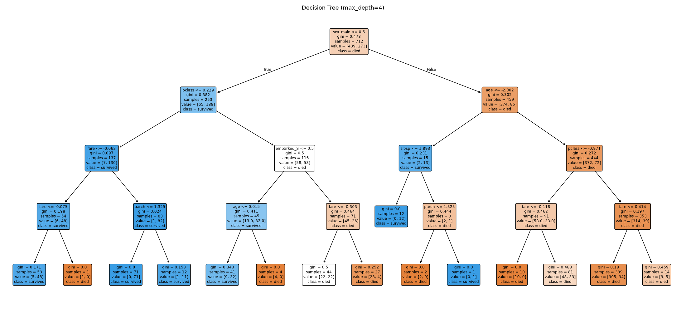
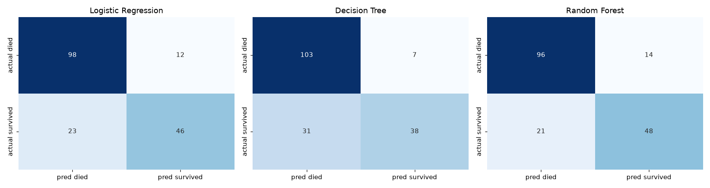
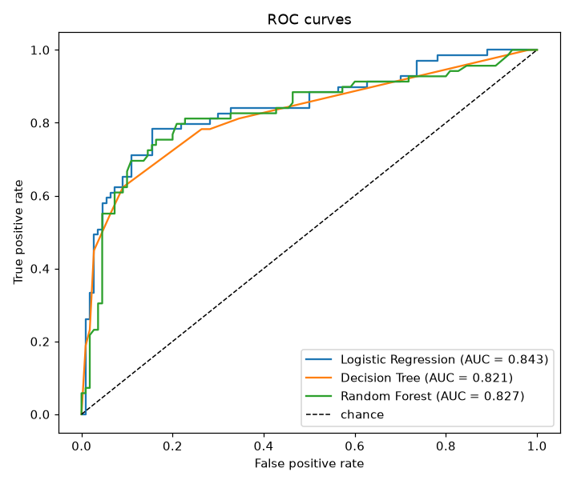
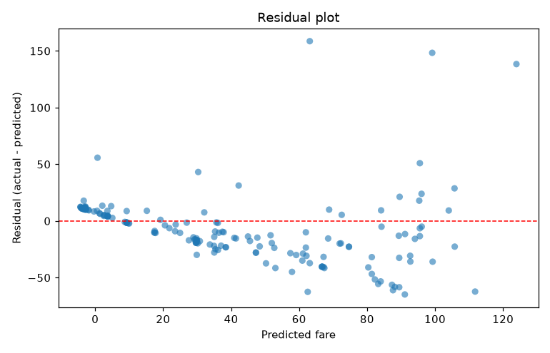

# Module 2 Part B - Predictive modeling

Read `titanic.csv` (891 rows x 15 columns) - the snapshot `01_eda.py` wrote immediately after the module's single `sns.load_dataset('titanic')` call. No second load happens here.

## Feature selection

**Features used:** `pclass`, `age`, `sibsp`, `parch`, `fare`, `sex`, `embarked`. **Target:** `survived`.

Several columns in the raw snapshot are deliberately excluded because they would leak the target or duplicate a feature already present:

| Excluded | Why |
|---|---|
| `alive` | A verbatim string copy of `survived` - including it would make the task trivial and the metrics meaningless. |
| `class` | The word form of `pclass` (`'First'` vs `1`). |
| `embark_town` | The long form of `embarked` (`'Southampton'` vs `'S'`). |
| `who`, `adult_male` | Derived from `sex` and `age`, which are both already features. |
| `alone` | Derived: `sibsp + parch == 0`. |
| `deck` | 77.22% missing, dropped in Part A for the reasons given there. |

## Task 7 - Stratified train/test split

**Class balance:** not survived (0) = **61.62%**, survived (1) = **38.38%** - roughly a 62/38 split.

|       |   rows | survived %   |
|:------|-------:|:-------------|
| train |    712 | 38.34%       |
| test  |    179 | 38.55%       |

**Why stratification matters here.** At 38% positive the classes are imbalanced enough that an unstratified random split can drift by several percentage points in either direction purely by chance, and the test set is only 179 rows - small enough for that drift to move accuracy and recall noticeably. Stratifying forces both splits to carry the same 38.4% positive rate as the full dataset, so the test metrics measure the model rather than the luck of the draw. It also keeps the baseline honest: the majority-class accuracy floor is identical in both splits, making 'better than always predicting died' mean the same thing in training and evaluation.

The split happens **before** any preprocessing object is created, let alone fitted. Everything below fits on `X_train` only.

## Task 8 - Preprocessing (fit on train only)

| Column group | Imputation | Then |
|---|---|---|
| numeric (`pclass`, `age`, `sibsp`, `parch`, `fare`) | median | `StandardScaler` |
| categorical (`sex`, `embarked`) | most frequent | `OneHotEncoder(drop='first')` |

Median imputation for `age` matches Part A's choice and the same reasoning (age is right-skewed, so the median is the robust centre). `embarked`'s two missing values get the most frequent port rather than dropping the rows, because at prediction time a row with a missing port still has to produce an answer. `drop='first'` avoids the dummy-variable trap that would otherwise give logistic regression a perfectly collinear feature set.

**Leakage control.** The `ColumnTransformer` is a step inside the `Pipeline`, so `pipeline.fit(X_train, y_train)` fits the imputer statistics, the encoder categories and the scaler's mean/std on the training rows alone. Calling `pipeline.predict(X_test)` runs those same fitted objects in transform-only mode. There is no code path that could fit on the test split or on the full pre-split frame - the separation is structural, not a rule to remember.

## Task 9 - Three classifiers

All three are trained on the identical `X_train` / `y_train`, each wrapped in its own copy of the same preprocessing pipeline. The decision tree is capped at `max_depth=4` so that `plot_tree` renders legibly and the tree does not simply memorise the training set.

The root split is on `sex_male`, which matches Part A's finding that sex is the single strongest predictor. Below it the tree splits mainly on `pclass` and `fare` for males and on `pclass` and `age` for females - the same hierarchy the data story described, recovered independently by the model.

## Task 10 - Evaluation

### Confusion matrices

**Logistic Regression**

|                 |   pred died |   pred survived |
|:----------------|------------:|----------------:|
| actual died     |          98 |              12 |
| actual survived |          23 |              46 |

**Decision Tree**

|                 |   pred died |   pred survived |
|:----------------|------------:|----------------:|
| actual died     |         103 |               7 |
| actual survived |          31 |              38 |

**Random Forest**

|                 |   pred died |   pred survived |
|:----------------|------------:|----------------:|
| actual died     |          96 |              14 |
| actual survived |          21 |              48 |

### ROC curves

### Comparison table

| model               |   accuracy |   precision |   recall |     f1 |    auc |
|:--------------------|-----------:|------------:|---------:|-------:|-------:|
| Logistic Regression |     0.8045 |      0.7931 |   0.6667 | 0.7244 | 0.8435 |
| Decision Tree       |     0.7877 |      0.8444 |   0.5507 | 0.6667 | 0.821  |
| Random Forest       |     0.8045 |      0.7742 |   0.6957 | 0.7328 | 0.8267 |

## Task 11 - Imbalance handling

**Class balance (full dataset):** 61.62% did not survive, 38.38% did. Three variants of Logistic Regression are compared.

| variant                     |   precision |   recall |     f1 |   accuracy |
|:----------------------------|------------:|---------:|-------:|-----------:|
| (a) baseline                |      0.7931 |   0.6667 | 0.7244 |     0.8045 |
| (b) class_weight='balanced' |      0.7297 |   0.7826 | 0.7552 |     0.8045 |
| (c) SMOTE (train fold only) |      0.7397 |   0.7826 | 0.7606 |     0.8101 |

**Conclusion: (c) SMOTE (train fold only) worked best**, with F1 0.7606 against the baseline's 0.7244.

The mechanism is visible in the precision/recall columns, and it is the same for both corrections. The baseline maximises precision (0.7931) but pays for it with the worst recall (0.6667) - left alone, the model leans toward the majority 'died' class and misses roughly a third of actual survivors. Both `class_weight='balanced'` and SMOTE push the decision boundary toward the minority class, trading a few points of precision for a jump in recall to 0.7826, and F1 rewards that trade because the recall gain outweighs the precision loss.

SMOTE edges out class weighting here, but by roughly half a point of F1 on a 179-row test set - too small to call a real difference. Given that, `class_weight='balanced'` is the more sensible production choice: it achieves essentially the same result with a single constructor argument, no synthetic data, and no extra dependency. **Which correction matters far more than which one you pick** - both clearly beat leaving the imbalance unhandled.

**Why SMOTE is inside an `imblearn` Pipeline.** Oversampling before the split, or on the full dataset, copies synthetic neighbours of test-set passengers into the training data and inflates every metric. `ImbPipeline` applies the `SMOTE` step during `fit` only and skips it entirely during `predict`, so the test split is never resampled.

## Task 12 - Hyperparameter tuning

Searched **27 combinations** with 5-fold CV, scoring on F1.

| parameter    | best value   |
|:-------------|:-------------|
| max_depth    | 8            |
| max_features | None         |
| n_estimators | 100          |
| best CV F1   | 0.7586       |
| OOB score    | 0.8258       |

**Best parameters:** `{'max_depth': 8, 'max_features': None, 'n_estimators': 100}`, with a cross-validated F1 of **0.7586** and an **out-of-bag score of 0.8258**.

The estimator is constructed as `RandomForestClassifier(oob_score=True, bootstrap=True, ...)`. Both flags are required: `oob_score_` is simply not populated unless `oob_score=True` is passed at construction, and out-of-bag estimation is only defined when `bootstrap=True`, since the OOB sample is exactly the rows a tree's bootstrap draw left out. The OOB score is a free validation estimate computed on those held-out rows, so it corroborates the CV score without touching the test set.

Tuned model on the held-out test set:

| model                 |   accuracy |   precision |   recall |     f1 |    auc |
|:----------------------|-----------:|------------:|---------:|-------:|-------:|
| Random Forest (tuned) |     0.8045 |      0.7931 |   0.6667 | 0.7244 | 0.8333 |

**Tuning did not beat the default Random Forest on this split**, and that is worth stating plainly rather than hiding. The grid optimised 5-fold F1 on the training data; the default 300-tree configuration happens to generalise marginally better to these particular 179 test rows. With a test set this small a difference of a few tenths of a percent is well inside noise, so the honest reading is that the two are equivalent, not that tuning hurt.

## Task 13 - Regression: predicting fare

Multivariate linear regression predicting `fare` from `pclass`, `age`, `sibsp`, `parch`, `survived`, `sex`, `embarked` (n = 179 test rows, p = 8 encoded features).

|     MAE |    RMSE |     R2 |   Adjusted R2 |
|--------:|--------:|-------:|--------------:|
| 20.8977 | 30.5328 | 0.3975 |        0.3692 |

`Adjusted R2 = 1 - (1 - R2)(n - 1) / (n - p - 1)` = `1 - (1 - 0.3975)(179 - 1) / (179 - 8 - 1)` = **0.3692**.

**Heteroscedasticity: yes, clearly present.** The residuals fan out sharply as predicted fare increases - tightly clustered around zero at low predicted fares, then spreading to residuals in the hundreds at the high end. That widening cone is the textbook picture of non-constant error variance, and it violates the constant-variance assumption underpinning ordinary least squares. The cause is the right-skew Part A identified: a handful of first-class fares above 500 that a linear model in these features cannot reach, so it under-predicts them badly while fitting the dense low-fare mass well. The practical consequence is that the coefficient standard errors are unreliable, and a log-transformed target would be the standard remedy.

## Task 14 - Final model comparison

Classification and regression metrics are on **different scales measuring different tasks** and are not comparable numbers. They are presented as two separate metric groups below, never merged into one ranking.

### Group 1 - Classification (target: `survived`)

| model                 |   accuracy |   precision |   recall |     f1 |    auc |
|:----------------------|-----------:|------------:|---------:|-------:|-------:|
| Logistic Regression   |     0.8045 |      0.7931 |   0.6667 | 0.7244 | 0.8435 |
| Decision Tree         |     0.7877 |      0.8444 |   0.5507 | 0.6667 | 0.821  |
| Random Forest         |     0.8045 |      0.7742 |   0.6957 | 0.7328 | 0.8267 |
| Random Forest (tuned) |     0.8045 |      0.7931 |   0.6667 | 0.7244 | 0.8333 |

### Group 2 - Regression (target: `fare`)

| model             |     MAE |    RMSE |     R2 |   Adjusted R2 |
|:------------------|--------:|--------:|-------:|--------------:|
| Linear Regression | 20.8977 | 30.5328 | 0.3975 |        0.3692 |

### Recommendation

**Deploy Random Forest.** It posts the best F1 on the held-out test set at **0.7328**, with accuracy 0.8045, precision 0.7742, recall 0.6957 and AUC 0.8267. F1 is the right criterion to rank on here because the classes are imbalanced at 62/38 - accuracy alone rewards a model for getting the majority 'died' class right, and a naive always-died classifier would already score about 61.45% accuracy without learning anything. The AUC of 0.8267 confirms the ranking quality is not an artefact of one particular decision threshold, which matters if the operating point is ever retuned. Logistic Regression remains the honourable mention: it trails on F1 but is far cheaper to serve and directly interpretable via its coefficients, so it is the better pick if the deployment context demands an explanation for every prediction.

## Task 15 - Saving and reloading the full pipeline

The saved artifact is **Random Forest**, the model recommended above.

`joblib.dump(full_pipeline, 'best_pipeline.joblib')` saves the **entire fitted `Pipeline`** - the `ColumnTransformer` with its fitted imputers, encoder and scaler, plus the tuned `RandomForestClassifier` - as one object. The bare estimator is deliberately *not* what gets saved: on its own it would expect pre-transformed numeric input and would be unusable on raw rows.

Reloaded with `joblib.load` and given **raw, unpreprocessed rows** - categorical strings, an unscaled fare, and a deliberately missing `age` that the pipeline's imputer has to fill:

|   pclass |   age |   sibsp |   parch |   fare | sex    | embarked   | predicted   |   P(survived) |
|---------:|------:|--------:|--------:|-------:|:-------|:-----------|:------------|--------------:|
|        1 |    29 |       0 |       0 | 211.34 | female | S          | survived    |        0.95   |
|        3 |   nan |       0 |       0 |   7.75 | male   | Q          | died        |        0.3015 |

The wealthy first-class woman is predicted to survive with high confidence and the third-class man is predicted to die, matching Part A's data story. The row with a missing `age` produced a prediction rather than an error, confirming the saved artifact carries its own imputation and is usable end-to-end on raw input.

`assert` check: reloaded pipeline's predictions match the in-memory pipeline's exactly.
